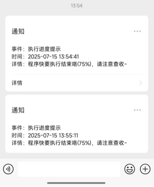
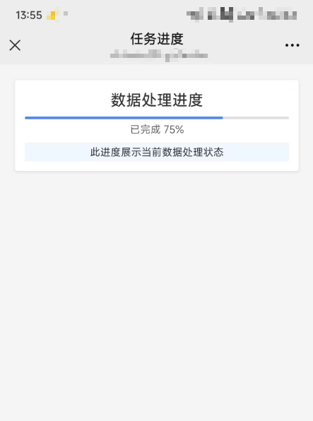

# WxNotice

类似于：`WxPusher`，`虾推啥`等，本项目使用cloudflare的 `workers` 来充当微信测试公众号的后台，实现随时随地推送消息到微信，适用于个人开发者。

## 说明

测试公众号申请地址：[weixin-sandbox](https://mp.weixin.qq.com/debug/cgi-bin/sandbox?t=sandbox/login)。
测试号可体验完整功能，限制是：最多只有20个用户，且仅能使用明文传输。有条件的小伙伴可以使用认证后的微信公众号。
测试号完全可以满足个人开发者需求。

## 示例图

图1：带详情和不带详情的通知示例  


图2：内容过期  


图3：正常详情示例  



# 部署

## 微信测试号

+ 前往[测试公众号后台](https://mp.weixin.qq.com/debug/cgi-bin/sandbox?t=sandbox/login)，注册/登录
+ 获取 `appID`, `appsecret`
+ 扫码关注测试号，获取自己的 `openid`
+ 添加模板，记录 `templateid` 和模板使用的变量名称，示例：
```js
事件：{{event.DATA}}
时间：{{time.DATA}}
详情：{{detail.DATA}}
// 该示例中，变量名称为：event, time, detail
```
+ 设置接口 `URL` 和 `Token`，待服务部署并启动后再确认

## 部署本服务

+ fork或者clone该项目到本地
+ 安装依赖：`npm i`
+ 将 [wrangler-expamle.jsonc](wrangler-expamle.jsonc) 重命名为 `wrangler.jsonc`
+ 修改 `wrangler.jsonc` 内容：
  - `routes.pattern`: 修改为自己的域名，需要和接口 `URL` 对应
  - `kv_namespaces.id`：修改为cloudflare上的某个kv存储库的id（新建kv存储）
  - `vars.WorkerHost`：修改为 接口 `URL` + `/send`，如：`https://wx-notice.your-domain.com/send`。用于RPC服务确定存储地址，RPC没有request所以无法取得origin
  - `vars.AppID`：修改为 `appID`
  - `vars.AppToken`：修改为接口 `Token`
  - `vars.AppSecret`：修改为 `appsecret`
  - `vars.Owner`：修改为 `openid`
  - `vars.DefaultTemplate`：修改为 `templateid`
  - 其它：`vars.*` 可按照自己的需求修改
+ 部署：`npm run deploy`
+ 前往微信测试号后台确认接口配置信息


# 使用

## 说明

往 `https://wx-notice.your-domain.com/send` 接口发送 `POST` 请求，在请求头中设置 { `Your-Auth-Header`: `YourAuthValue` } 以实现鉴权。
请求体（JSON格式）：
```js
{
  "option": {
    // "template": "",  // 不填则使用默认的模板
    // "uid": "",  // 不填则发送到默认接收人，Owner
    /*
    url和detail是于详情相关的配置，且url优先。
    当url和detail都为空时，推送的消息没有详情连接，当url不为空时则详情取值为url（忽略detail）。
    当url为空detail不为空时，将detail.content存储到本项目的kv存储库内，并分配内容访问凭证ticket，
    可通过：`https://wx-notice.your-domain.com/detail/<ticket>` 访问对应的content（支持html）。
    content最大长度有 `vars.MaxContentLength` 确定，默认1MB，超出部分将会截断；
    content最大存储时长由 `vars.MaxContentTTL` 确定，默认1天。
    */
    // "url": "https://www.cloudflare.com/",
    "detail": {
      "ttl": 120,  // 该content的可访问时间，最低60s，最大 `vars.MaxContentTTL`
      // 具体内容
      "content": "<!DOCTYPE html><html lang=\"zh\"><head><title>任务进度</title><style> * {margin: 0;padding: 0;box-sizing: border-box;font-family: \"Segoe UI\", Tahoma, Geneva, Verdana, sans-serif;}  body {background: #f5f5f5;}  .progress-container {width: 90vw;margin: 50px auto 0;padding: 30px;background: white;border-radius: 8px;box-shadow: 0 3px 10px rgba(0, 0, 0, 0.1);text-align: center;}  .title {margin-bottom: 20px;color: #333;font-size: 3em;font-weight: 500;}  .progress-bar {height: 8px;background: #e0e0e0;border-radius: 4px;overflow: hidden;}  .progress-fill {height: 100%;background: #4285f4;width: 75%;border-radius: 4px;}  .progress-value {margin-top: 10px;font-size: 2em;color: #666;}  .note {margin-top: 20px;padding: 8px;background: #f0f7ff;border-radius: 4px;color: #333;font-size: 2em;}</style></head><body><div class=\"progress-container\"><h2 class=\"title\">数据处理进度</h2><div class=\"progress-bar\"><div class=\"progress-fill\"></div></div><div class=\"progress-value\">已完成 75%</div><div class=\"note\">此进度展示当前数据处理状态</div></div></body></html>"
    }
  },
  "params": {  // 模板内的参数和取值，不传则对应字段为空
    "event": "执行进度提示",
    "time": "2025-07-15 12:00:54",
    "detail": "程序快要执行结束咯(75%)，请注意查收~"
  }
}
```

## worker间调用

**v1.0.1新增**
+ 优点：响应快、不消耗Cloudflare流量
+ 缺点：仅限于cloudflare worker，且本地开发时不可用。所以其它服务也是worker时，推荐使用此方式

注：在新worker的配置文件中添加：
```jsonc
{
  "services": [
		{
			"binding": "WxNotice",
			"service": "wx-notice",  // 本服务的cloudflare worker名称
			"entrypoint": "RpcWxNotice"  // 本服务暴露的rpc接口类
		}
	]
}
```

### Fetch方式

```js
// 构造请求
const payload = {
  option: {
    url: "https://wwww.cloudflare.com/"
  },
  params: {
    event: "查看新闻",
    time: "just now",
    detail: "重大事件，Cloudflare是赛博大善人！"
  }
};
const req = new Request(
  "https://wx-notice.your-domain.com/send",
  {
    method: "POST",
    headers: {
      "Your-Auth-Header": "YourAuthValue",
      "Content-Type": "application/json; charset=utf-8"
    },
    body: JSON.stringify(payload)
  }
);
try {
  await env.WxNotice.fetch(req);
} catch(e) {
  console.warn(e.message)
}
```

### RPC方式

```js
const payload = {
  option: {
    url: "https://wwww.cloudflare.com/"
  },
  params: {
    event: "查看新闻",
    time: "just now",
    detail: "重大事件，Cloudflare是赛博大善人！"
  }
};
try {
  await env.WxNotice.sendNotice(payload);
} catch(e) {
  console.error(e.message)
}
```

## HTTP请求调用

+ 优点：只要能发HTTP请求，就可以实现微信通知
+ 缺点：走Cloudflare流量，速度较慢

### JS-fetch

```js
const html = `<!DOCTYPE html><html lang="zh"><head><title>任务进度</title><style> * {margin: 0;padding: 0;box-sizing: border-box;font-family: "Segoe UI", Tahoma, Geneva, Verdana, sans-serif;}  body {background: #f5f5f5;}  .progress-container {width: 90vw;margin: 50px auto 0;padding: 30px;background: white;border-radius: 8px;box-shadow: 0 3px 10px rgba(0, 0, 0, 0.1);text-align: center;}  .title {margin-bottom: 20px;color: #333;font-size: 3em;font-weight: 500;}  .progress-bar {height: 8px;background: #e0e0e0;border-radius: 4px;overflow: hidden;}  .progress-fill {height: 100%;background: #4285f4;width: 75%;border-radius: 4px;}  .progress-value {margin-top: 10px;font-size: 2em;color: #666;}  .note {margin-top: 20px;padding: 8px;background: #f0f7ff;border-radius: 4px;color: #333;font-size: 2em;}</style></head><body><div class="progress-container"><h2 class="title">数据处理进度</h2><div class="progress-bar"><div class="progress-fill"></div></div><div class="progress-value">已完成 75%</div><div class="note">此进度展示当前数据处理状态</div></div></body></html>`;
const payload = {
  "option": {
    "detail": {
      "ttl": 120,
      "content": html
    }
  },
  "params": {
    "event": "执行进度提示",
    "time": "2025-07-15 12:00:54",
    "detail": "程序快要执行结束咯(75%)，请注意查收~"
  }
};
const options = {
  method: "POST",
  headers: {
    "Your-Auth-Header": "YourAuthValue",
    "Content-Type": "application/json"
  },
  body: JSON.stringify(payload)
};

fetch("https://wx-notice.your-domain.com/send", options)
  .then(response => response.json())
  .then(response => console.log(response))
  .catch(err => console.error(err));
```

### Python-requests

```python
import requests

url = "https://wx-notice.your-domain.com/send"
payload = {
  "option": {
    "url": "https://wwww.cloudflare.com/"
  },
  "params": {
    "event": "查看新闻",
    "time": time.strftime("%Y-%m-%d %H:%M:%S", time.localtime()),
    "detail": "重大事件，Cloudflare是赛博大善人！"
  }
}
header = {
  "Your-Auth-Header": "YourAuthValue"
}
res = requests.post(url, headers=header, json=payload)
print(res.json())
```

### Java-okhttp+fastjson

```java
OkHttpClient client = new OkHttpClient();
MediaType mediaType = MediaType.parse("application/json");

JSONObject detail = new JSONObject();
detail.put("ttl", 120);
detail.put("content", "<!DOCTYPE html><html lang=\"zh\"><head><title>任务进度</title><style> * {margin: 0;padding: 0;box-sizing: border-box;font-family: \"Segoe UI\", Tahoma, Geneva, Verdana, sans-serif;}  body {background: #f5f5f5;}  .progress-container {width: 90vw;margin: 50px auto 0;padding: 30px;background: white;border-radius: 8px;box-shadow: 0 3px 10px rgba(0, 0, 0, 0.1);text-align: center;}  .title {margin-bottom: 20px;color: #333;font-size: 3em;font-weight: 500;}  .progress-bar {height: 8px;background: #e0e0e0;border-radius: 4px;overflow: hidden;}  .progress-fill {height: 100%;background: #4285f4;width: 75%;border-radius: 4px;}  .progress-value {margin-top: 10px;font-size: 2em;color: #666;}  .note {margin-top: 20px;padding: 8px;background: #f0f7ff;border-radius: 4px;color: #333;font-size: 2em;}</style></head><body><div class=\"progress-container\"><h2 class=\"title\">数据处理进度</h2><div class=\"progress-bar\"><div class=\"progress-fill\"></div></div><div class=\"progress-value\">已完成 75%</div><div class=\"note\">此进度展示当前数据处理状态</div></div></body></html>");
JSONObject option = new JSONObject();
option.put("detail", detail);
JSONObject params = new JSONObject();
params.put("event", "执行进度提示");
params.put("time", "2025-07-15 12:00:54");
params.put("detail", "程序快要执行结束咯(75%)，请注意查收~");
JSONObject payload = new JSONObject();
payload.put("option", option);
payload.put("params", params);
String jsonString = payload.toJSONString();

RequestBody body = RequestBody.create(mediaType, jsonString);
Request request = new Request.Builder()
  .url("https://wx-notice.your-domain.com/send")
  .post(body)
  .addHeader("Your-Auth-Header", "YourAuthValue")
  .addHeader("Content-Type", "application/json")
  .build();

Response response = client.newCall(request).execute();
```
